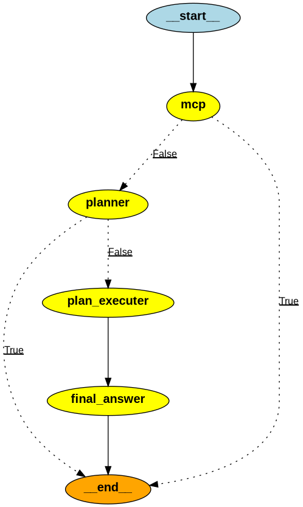

# Main changes and improvements

## Linting and Code Quality
- Implemented precommit hooks using `pre-commit` to ensure code quality.
- Refactored code to standard python project

## Agent design

### Overview
the baseline agent had a big problem, it has a bigger context which gives a lot of token consumption
big context gives bad llm performance.

### Agent Architecture

To improve the agent's performance and efficiency, and reduce token consumption, I redesigned the agent architecture as follows:
The main idea is inspired from **RAG**. Instead of using vector embeddings to retrieve relevant calls and emails, I used the LLM to
generate list of topics (themes) for each call and email during the data ingestion phase. Then at query time,
when a user query is received, the agent uses the LLM to generate a list of relevant topics from the user query.
These topics are then used to **retrieve** the calls and emails that are relevant to the user query.
I used other tools to filter the calls and emails based on the topics. Like filtering by date or indices and computing len.

The agent starts with the **mcp node** which fetches all calls and emails for the selected account.
It passes to the end when **no data is found**. Otherwise, it goes to the planner node.
The **planner node** is an LLM-powered node that creates a plan to filter irrelevant calls/emails based on user query.
The planner uses **gpt-5-mini** with low **reasoning** capabilities. We use reasoning because this Agent node is so important for final results quality
The **plan executor node** executes the plan created by the planner node by calling the appropriate tools.
It aggregates results from multiple tool calls and **builds context** for final answer generation.
Finally, the **final answer node** is an LLM-powered node that generates the final answer based on the user query and aggregated context from plan_executor.
No reasoning is needed here because the context is supposed to be small and relevant.

A change in the graph I would do is to modify the conditional edge after the planner node to go directly to the final answer node if the plan is empty taking the full context.

### Token usage tracking

I used Langchain callbacks to track the token usage of each LLM call.

## Evaluation using LLM as judge

I implemented an evaluation script that uses LLM as judge to evaluate the performance of the baseline agent and my improved agent.
The evaluation script is located in `scripts/llm_as_judge.py`. Needs to be more cleaned.
It takes the two question, the whole calls/emails concatenated as context, and the answers from both agents.
Then it prompts the LLM to evaluate the answers based on relevance, accuracy, and completeness.

### Results

I runed the evaluation script `scripts/run_agent.py` on both the baseline and my improved agent on all 10 accounts.
And obtained the following results:

| Method                          | Baseline      | My Agent     |
|---------------------------------|---------------|--------------|
| LLM as judge eval average score | 5.1 / 10      | 8.4/10       |
| total cost                      | 0.053738549 $ | 0.00317895 $ |
| average time taken              | 40.51 s       | 79.20 s      |

The Baseline is faster that the new agent.
But the new agent is much cheaper because of context optimisation and has a much better performance in terms of LLM as judge evaluation.

## Dockerization

I made some modifications to the code to make sure everything works well with docker.
Then I added dockerfiles for each service and a docker-compose file to orchestrate the services.
This allows for easy deployment of the system.

# What would you do if you had more time for the implementation?
If I had more time, I would focus on the following areas to further enhance the implementation.
1. **Testing**: Implement tests on the components of the agent, using mocking for the LLM calls and MCP server. And an end-to-end test for the whole system.
2. **Caching**: test the caching mechanisms to store frequently accessed data and LLM responses to reduce latency and costs (if optimal).
3. **CI** implement the unit tests and the end-to-end tests in a CI pipeline to ensure code quality and prevent regressions.
4. **Chatbot** Improve the webapp to support a chat interface instead of single query-response interactions. Plus implement llm history caching to reduce token consumption for follow-up questions.
5. **Steaming**: Enhance the streaming capabilities of the agent to provide real-time responses to user queries.
6. **Scripts** folder is not well clean due to lack of time. I would clean it and document it better.
7. **Agent optimizations**: Take time to improve the agent prompts and tools, test more cases to covers potential errors, and investigate why it is slower than the baseline. Implement LLM callback, when the principal LLM fails, we can retry with another model.

# How would you make it production-ready?
To make the implementation production-ready we should do the following:
- Have a strong CD/CI pipeline to automate testing, building, and deployment processes.
- Implement proper logging.
- Push the docker images to a container registry or Docker Hub.
- Host the MCP data outside the container, using Postgres data like Supabase or any other database. So we can support big volume of data.
- Implement LLM monitoring tools (Like Langfuse), and general monitoring like graphana for tracking system health and general performance.
- Replace streamlit webapp with a more robust frontend framework like React or Vue.js for better user experience and scalability.
- Handling security issues, like securing API keys, and access control.
